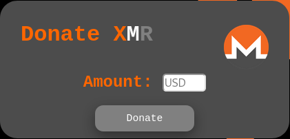

# xmrSale
### (Monero specialized fork of [SatSale](https://github.com/nickfarrow/xmrSale))
xmrSale is a simple, easily deployable, lightweight Monero payment processor that connects to your own Monero node.

Please support [via the Monero Community Crowdfunding System](https://repo.getmonero.org/monero-project/ccs-proposals/-/merge_requests/246).

## [try.xmrsale.org](https://try.xmrsale.org)

With your support, we will continually work to ensure that xmrSale remains up-to-date with the SatSale project, and also building above and beyond:
* Tor
* A zero-node mode (xpub and blockexplorers)
* Further webstore plugins
* **Better UI** with more variety of size and theme.
    * Add a currency toggle between XMR/USD on donation html.
* Timedout payment recourse.
* Different price feeds with various currencies
* Tell us what you, the community, desire! I intent to many other features alongside the CCS milestones.

Many requested features have already been added (docker, monero logo, wallet-rcp instructions) or are under development.

**xmrSale is currently under development and does not yet work 100%**. We will add a button green here when it is in a usable state! **ETA 3 days**. Anything below this button is likely outdated, probably will not work, and will  be updated as transition to Monero from Bitcoin proceeds.


Donation Button     ----->  |  Monero Payment Gateway
:-------------------------:|:-------------------------:
[](https://try.xmrSale.org/) <br />(Click for embed demo)<br /> Initiates payment -----> |  [](https://try.xmrSale.org/) <br />(Click for WordPress payments demo)

- [Purpose](#purpose)
- [Features](#features)
- [Installation (short!)](#installation--short--)
    + [Install](#install)
    + [Connect to your Monero Node](#connect-to-your-monero-node)
    + [Run xmrsale](#run-xmrsale)
    + [Embed a Donation Button](#embed-a-donation-button)
    + [Using HTTPS & Domains](#using-https---domains)
    + [Security](#security)
    + [Payment Gateway (Woocommerce)](#payment-gateway--woocommerce-)
- [Contributions welcomed](#contributions-welcomed)
- [Coming soon](#coming-soon)
- [Disclaimer](#disclaimer)
- [Sponsor](#sponsor)

## [try.xmrsale.org](https://try.xmrsale.org)

xmrSale currently serves as a
1. Donation button for your website that you can easily embed/link to anywhere.
2. Monero payment gateway, including a Woocommerce plugin that easily turns ANY Wordpress site into a Monero accepting store.

xmrSale makes donation buttons simple - easy copy paste the one line HTML iframe into your site. With a simple Python backend to talk to your own Monero node, xmrSale uses RPC to generate new addresses, and monitors the payment status with your own copy of the blockchain.

# Features
* Process payments with your own Monero node via RPC and SSH. Monero core, or any other node software that supports RPC calls.
* Direct peer-to-peer payments without any middleman. No KYC, and greater privacy than donation systems wher Monero addresses are reused multiple times.
* Lightweight and highly extendable, basic html and css stying. Modular Python backend, take a [look at the code](xmrsale.py).
* Natively extendable to all Monerod node features (e.g. segwit) through RPC.
* QR codes, customizable required payment confirmations and payment expiry time.
* Privacy ensured. Monero only.

# Installation (short!)
You require a Monero node, if you don't have one you should [install one](https://sethforprivacy.com/guides/run-a-monero-node-advanced/) preferably on a Raspberry Pi / server (VPS). While you can run xmrSale on this same machine, a separate VPS is recommended.
### Install
Clone and install dependencies
```
git clone https://github.com/xmrsale/xmrSale
cd xmrSale/
pip3 install -r requirements.txt
```
### Connect to your Monero Node
Edit the `config.py` configuration and point to your Monero node:
```python
host = "127.0.0.1"
monerod_rpcport = "18081"
monerowallet_rpcport = "18090"
monerod_username = "MONERODRPC_USER"
monerod_password = "MONERODRPC_PASS"
wallet_username = "WALLETRPC_USER"
wallet_password = "WALLETRPC_PASS"
```
You can find these monerod rpc details in `monero.conf` or in daemon arguments within your systemd `.service`.

To be able to connect to your node with full ability to create addresses, we need to have a `monero wallet RPC` service running alongside our monerod RPC. Note most node guides do not install this by default, including sethforprivacy's.

To run `monero-wallet-rpc` with arguments, it is probably easiest to run this as a service like you may have done for your monerod daemon. We  will just create a similar `.service`, here is an example [monerowallet.service](docs/monerowallet.service). You can set the wallet RPC login as arguments in this file.

Connecting to a remote node is easy and can be done over SSH tunneling or tor hidden services (tor not yet working), examples can be found in [docs/](docs/) (need work).

### Run xmrSale
Run xmrSale with
```
gunicorn -w 1 -b 0.0.0.0:8000 xmrsale:app
```
Gunicorn is a lightweight python HTTP server, alternatively you can run with just `python xmrsale.py` though this is not recommended for production.

That's it! You should now be able to view your xmrSale server at `http://YOUR_SERVER_IP:8000/`. If running locally, this will be `127.0.0.1:8000`.

If running on a Raspberry Pi, you will want to [forward port 8000 in your router settings](https://user-images.githubusercontent.com/24557779/105681219-f0f5fd80-5f44-11eb-942d-b574367a161f.png) so that xmrSale is also visible at your external IP address. You might have to allow gunicorn through your firewall with `sudo ufw allow 8000`.

You will want to run gunicorn with nohup so it continues serving in the background:
```
nohup gunicorn -w 1 0.0.0.0:8000 xmrsale:app > log.txt 2>&1 &
tail -f log.txt
```

### Embed a Donation Button
Now embed the donation button into your website HTML:
```html
<iframe src="http://YOUR_SERVER_IP:8000/" style="margin: 0 auto;display:block;width:420px;height:460px;border:none;overflow:hidden;" scrolling="no"></iframe>
```
Changing `YOUR_SERVER_IP` to the IP address of the machine you're running xmrSale on, node or otherwise. Additionally, you could redirect a domain to that IP and use that instead.

### Using HTTPS & Domains
Embedded iframes are easy if your site only uses HTTP. But if your site uses HTTPS, then you can see your donation button at `http://YOUR_SERVER_IP:8000/` but will not be able to in an embedded iframe. See [HTTPS instructions](docs/HTTPS.md).

### Security
For maximum security, we recommend hosting on a machine where your node only has access to a **watch-only** wallet.


### Payment Gateway (Woocommerce)
## NOT YET TESTED
Currently we have a plugin for Woocommerce in Wordpress that makes Monero webstores extremely easy, [please click here for installation instructions](docs/woocommerce.md). xmrSale acts as a custom payment gateway for Woocommerce via the php plugin found in `/gateways`. We have plans to extend to other web stores in the future.

# Contributions welcomed
### You only need a little python!
The main code can be found in [xmrsale.py](xmrsale.py). The client-side logic for initiating the payment and querying the API sits in [static/xmrsale.js](static/xmrsale.js), button appearance in [templates/index.html](templates/index.html), and Woocommerce plugin in [gateways/woo_xmrsale.php](gateways/woo_xmrsale.php). Please have ago at implementing some of the things below or in the issues!

# Disclaimer
xmrSale is in very early development. As such, we are not responsible for any loss of funds, vulnerabilities with software, or any other grievances which may arise. Always confirm large payments manually.

# Sponsor
Please consider [supporting me](https://try.xmrsale.org) via my own instance of xmrSale :). You should also join me in supporting the [xmrSale](https://xmrsale.org) project as we relied on it heavily as a code base.
